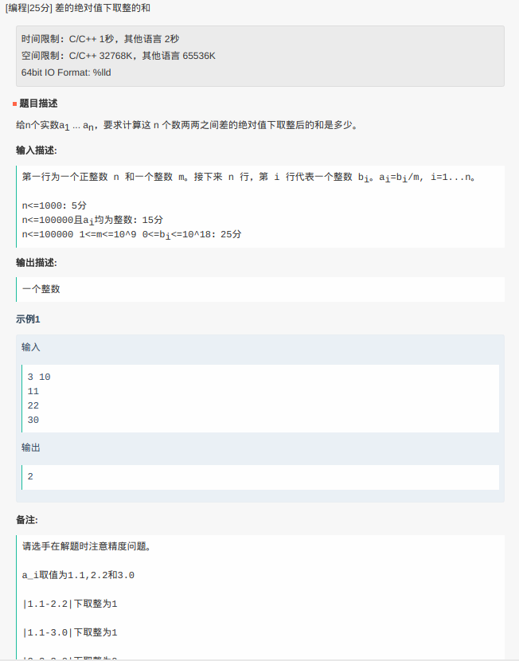

# 字节跳动笔试回忆

[TOC]

## 单选

1. 求输出：

   ```cpp
   #include <bits/stdc++.h>
   #include <zconf.h>
   using namespace std;
   class A{
   public:
       A(): a(0){
           cout << a << endl;
       }
       ~A(){
           cout << a << endl;
       }
       int a;
   };
   A a;
   int main(){
       if(fork() == 1){
           ++a.a;
       }
       return 0;
   }
   ```

## 多选

1. 线程返回值
2. x86套接字通信
   - host A: a = 0x12345678 send(sock, &a, 4)
   - client B: read(&b, 4) b?
   - client C: read(c, 4) c?

## 填空

1. 1, 3, 7, 13通过四则运算求30

2. 商人50元进货，标价210元，一顾客搞价到90元，然后拿100元假币购买，商人找不开，用这张假币与邻居兑换100元零钱，找给顾客10元，后邻居发现，商人又给邻居补偿100元，问商人损失多少。

3. 两矩阵相乘结果的逆序列个数

4. 20个电话号码，求两个以上电话号码末两位数字相同的概率

5. E(0.5X^2 - 1) = 2, D(0.5X - 1) = 0.5, 求E(X)

6. 正态分布，随机抽取10个数：

   374 383 390 395 398 402 405 410 417 426

   n = 10, 90% 的 t = 1.833

   求90%分布的上下界

7. 643512，多项式找规律

## 编程

1. ​一列数a1, a2, ... an中，-1e9 < ak < 1e9，求最大子数列和，并且这个子数列中0的数量不多于3.

2. 如图：

   


------

Contributors: Defjia, SupermeLiu, Roger Dai

Date: 2nd June, 2018